# Red-Black Tree Deletion Fix-Up

First, we use the **standard BST deletion**. Let's call **y** the node we want to delete and **x** the child that will take its place. When we put **x** instead of **y**, we also assign **y**'s color to **x**.  

The only problem arises if the spliced-out node **x** is black, since this could create a **double black node**. We handle this by moving the black node upward until we reach one of the following situations:

1. **x points to a red node** – we can simply recolor the node it points to black.  
2. **x points to the root of the tree** – we can remove the extra black.  
3. It's possible to use **rotations and recolorings** to restore the Red-Black Tree properties.  

We have **4 scenarios** to handle. Let **w** be the sibling of **x**:

1. **w is red**  
2. **w is black, w.left is black, and w.right is black**  
3. **w is black, w.left is red, and w.right is black**  
4. **w is black, w.right is red**  

---

## Case 1: w is red

- Switch the colors of **w** and **x**'s parent.  
- Perform a **left rotation**.  
- Adapt to the next case.

  <figure style="margin: 0;">
    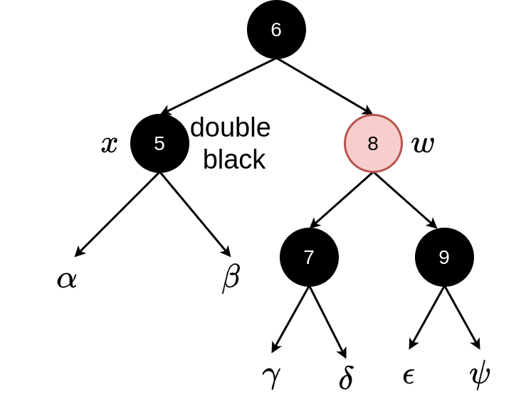
    <figcaption style="text-align: center;">Initial tree</figcaption>
  </figure>

  <figure style="margin: 0;">
    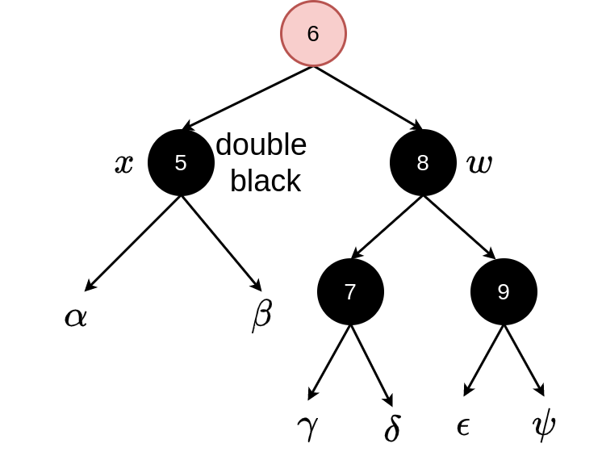
    <figcaption style="text-align: center;">Recoloring</figcaption>
  </figure>

  <figure style="margin: 0;">
    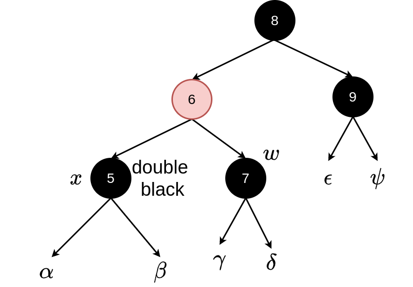
    <figcaption style="text-align: center;">Rotating</figcaption>
  </figure>

---

## Case 2: w is black, w.left is black, w.right is black

We **move the extra black up** by coloring the parent black and the sibling red.  

- If the parent was black, it becomes double black and we keep moving up the tree.  
- If the parent was red, the loop terminates.

  <figure style="margin: 0;">
    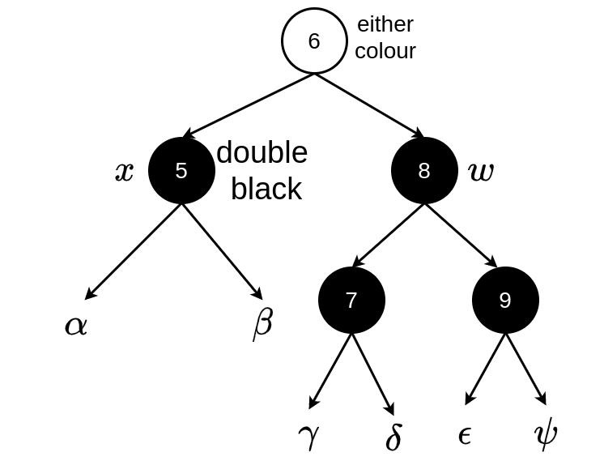
    <figcaption style="text-align: center;">Initial tree</figcaption>
  </figure>

  <figure style="margin: 0;">
    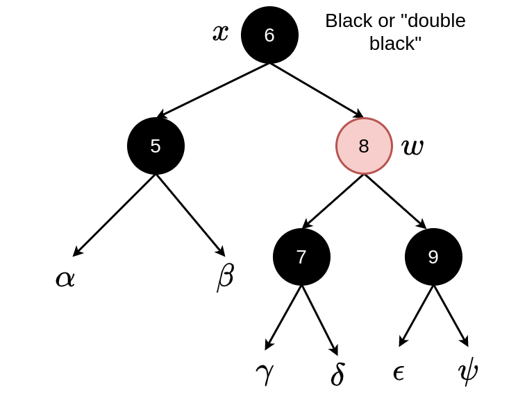
    <figcaption style="text-align: center;">Recoloring</figcaption>
  </figure>

---

## Case 3: w is black, w.left is red, w.right is black

- Switch the colors of **w** and its left child (the red one).  
- Perform a **right rotation**.  
- Since NULL nodes are black, this transforms the scenario into **case 4**.

  <figure style="margin: 0;">
    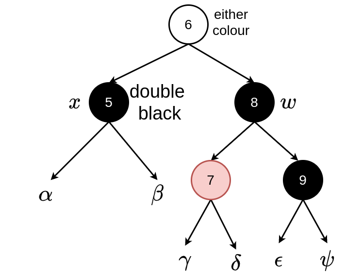
    <figcaption style="text-align: center;">Initial tree</figcaption>
  </figure>

  <figure style="margin: 0;">
    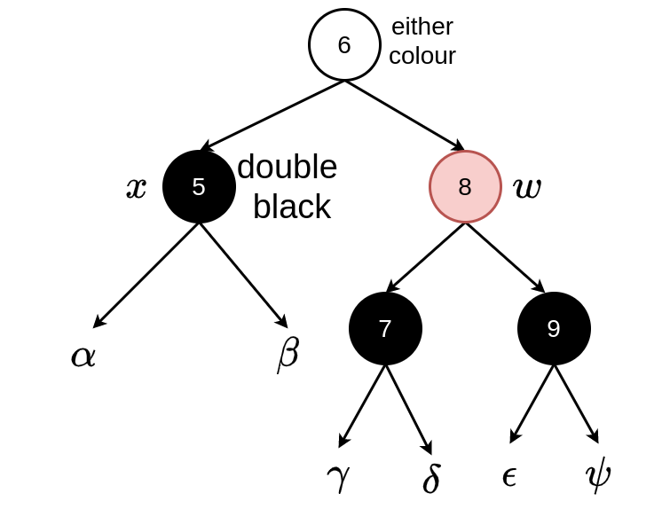
    <figcaption style="text-align: center;">Recoloring</figcaption>
  </figure>

   <figure style="margin: 0;">
    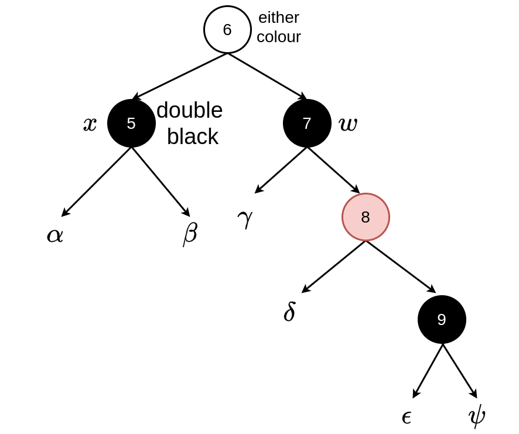
    <figcaption style="text-align: center;">Rotating</figcaption>
  </figure>

---

## Case 4: w is black, w.right is red

- Set **w** to the color of its parent.  
- Set the parent to black.  
- Set **w.right** to black.  
- Perform a **left rotation** on **x**'s parent.

  <figure style="margin: 0;">
    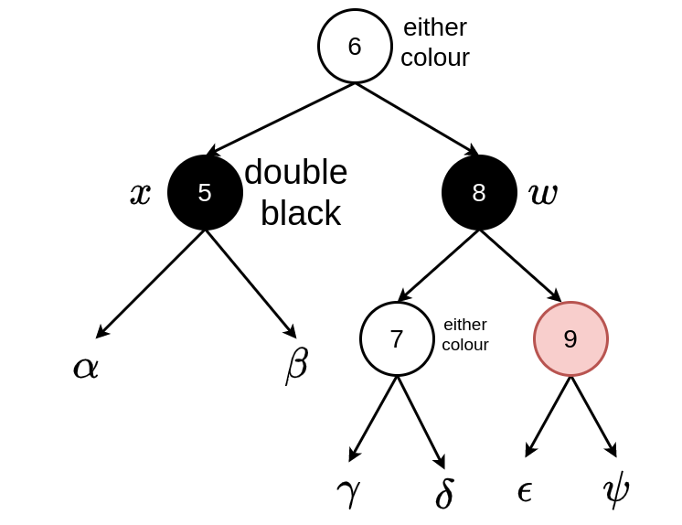
    <figcaption style="text-align: center;">Initial tree</figcaption>
  </figure>

  <figure style="margin: 0;">
    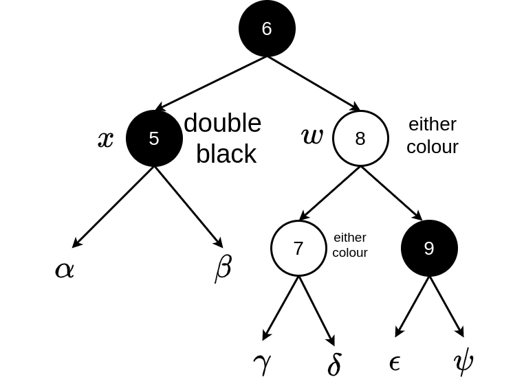
    <figcaption style="text-align: center;">Recoloring</figcaption>
  </figure>

   <figure style="margin: 0;">
    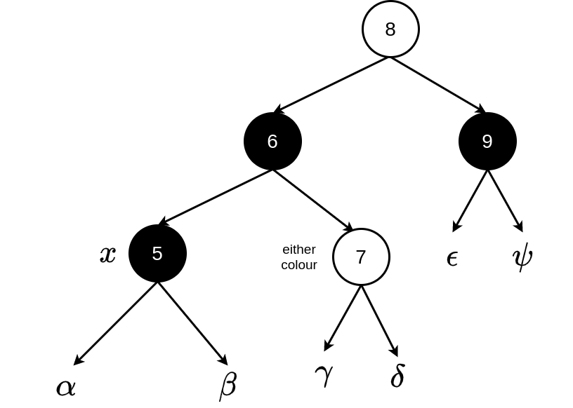
    <figcaption style="text-align: center;">Rotating</figcaption>
  </figure>

> **Note:** In the example above, the tree do not satisfy Red-Black Tree properties, but this is fine. The subtrees of a Red-Black Tree are not necessarily Red-Black Trees themselves. The key point is that we added a new black node to fix the double black issue so that the overall Red-Black Tree is valid.
