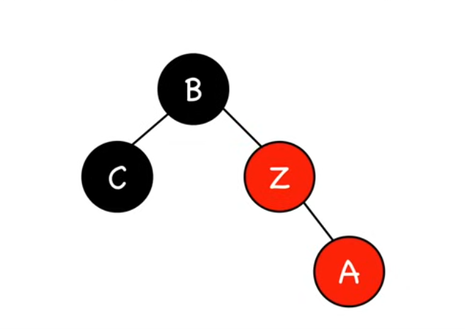

# Insertion

When we add an element to a Red-Black Tree, we then need to check if the properties of the Red-Black Tree are still satisfied and make changes if needed.

First, let's introduce rotations:

### Rotations

A left rotation is an operation that looks like a rotation of our tree.  
Here is an example:

<div style="display: flex; gap: 20px; align-items: flex-start;">
  <figure style="margin: 0;">
    
    <figcaption style="text-align: center;">Initial tree</figcaption>
  </figure>

  <figure style="margin: 0;">
    
    <figcaption style="text-align: center;">After 90° left rotation</figcaption>
  </figure>

  <figure style="margin: 0;">
    
    <figcaption style="text-align: center;">Final tree after adjustment</figcaption>
  </figure>
</div>

Starting with image 1, we rotate the tree just as if we were rotating our paper sheet 90° to the left.

In image 2, we see that node `10` has three children, so we need to remove one.  
We need to let `12` remain as the right child of `10` because it is greater than 10, and we move the old left child of `10` to become the right child of `5` since it is greater than 5.
After this adjustment, we end up with the tree shown in image 3.

Right rotation is the same process but in the opposite direction: you just need to read the diagrams in reverse order, starting with a 90° rotation to the right.

With this example we can write this simplified pseudo code for left rotation :

```text
# Variables

X = node_to_rotate              # `5` in our example
Y = X.right                     # `10` in our example
Z = Y.left                      # `8` in our example   

# Perform rotation

Y takes the place of X
Y.left = X                     
X.right = Z
```

In practice we would need to take care not to lose information while exchanging variables and do everything cleanly.

---

### Insertions

We are going to use this strategy to insert a node **Z**: first we insert **Z** and make it **red**, then adjust the tree so that it stays Red-Black based on 5 different scenarios:  

1. Z is the root  
2. Z's parent is black  
3. Z's parent is red and Z's uncle is red  
4. Z’s uncle is black and Z and Z’s parent are aligned  
5. Z’s uncle is black and Z and Z’s parent are opposite children (forming a triangle)  

---

#### Z is the root
**Action:** Color **Z black**  
- Since the root must always be black, no rotations are needed.  

---

#### Z's parent is black
**Action:** Do nothing  
- Adding a red node under a black parent does not violate any Red-Black properties.  

---

#### Z's parent is red and Z's uncle is red
**Action:** Recolor parent and uncle black, grandparent red, and move **Z** up to grandparent.  
- This resolves the red-red violation at **Z** and ensures the black-height property is maintained.  

<div style="display: flex; gap: 20px; align-items: flex-start;">
    <figure style="margin: 0;">
        
        <figcaption style="text-align: center;">Case 1-1</figcaption>
    </figure>
    <figure style="margin: 0;">
        
        <figcaption style="text-align: center;">Case 1-2</figcaption>
    </figure>
</div>

---

#### Z’s uncle is black and Z and Z’s parent are aligned
**Action:** Rotate at the **grandparent**, and swap colors of parent and grandparent.  

<div style="display: flex; gap: 20px; align-items: flex-start;">
    <figure style="margin: 0;">
        
        <figcaption style="text-align: center;">Initial tree</figcaption>
    </figure>
    <figure style="margin: 0;">
        
        <figcaption style="text-align: center;">Rotation at old grandparent</figcaption>
    </figure>
    <figure style="margin: 0;">
        
        <figcaption style="text-align: center;">Recoloring parent and grandparent</figcaption>
    </figure>
</div>

---

#### Z’s uncle is black and Z and Z’s parent are opposite children (forming a triangle)
**Action:** Rotate at **parent** to align nodes, then handle as aligned case.  

<div style="display: flex; gap: 20px; align-items: flex-start;">
    <figure style="margin: 0;">
        
        <figcaption style="text-align: center;">Triangle case step 1</figcaption>
    </figure>
    <figure style="margin: 0;">
        
        <figcaption style="text-align: center;">Triangle case step 2</figcaption>
    </figure>
</div>


After those changes, we may have created new color problems higher up in the tree. To fix this, we keep moving upward and applying the same process until all Red-Black properties are satisfied.


Now we can write this pseudo code for insertion :

```text
# Variables

B = root_of_tree                 # root of the Red-Black Tree
Z = node_to_insert               # the new node we want to insert
A = parent_of(Z)                 # parent of Z
C = uncle_of(Z)                  # uncle of Z

# Step 1: Insert Z like a normal BST node
BST_insert(B, Z)                 
Z.color = RED                    # new nodes are always red

# Step 2: Fix Red-Black properties
while Z != B and A.color == RED:

    C = uncle_of(Z)

    if C.color == RED:                       # Case 3: parent and uncle red
        A.color = BLACK
        C.color = BLACK
        A.parent.color = RED
        Z = A.parent                         # move problem up to grandparent

    else:                                    # Case 4 & 5: uncle is black
        if (Z is right child of A and A is left child) 
           or (Z is left child of A and A is right child):   # triangle
            Z = A
            rotate(Z)                        # rotate at parent to align

        # now aligned (both left or both right)
        swap_colors(A, A.parent)             # swap colors of parent & grandparent
        rotate(A.parent)                     # rotate at old grandparent

# Step 3: Ensure root is black
B.color = BLACK

```
