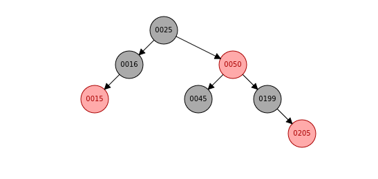

# Red-Black Tree Documentation

A **Red-Black Tree** is a self-balancing binary search tree where each node has an additional attribute: a **color**.  
A Red-Black Tree satisfies 5 properties:

1. Every node is either **red** or **black**  
2. The **root** of the tree is black  
3. A **red node cannot have red children**  
4. Every path from a specific node to any of its leaf node goes through the same amount of black nodes (the node itself is not counted but the **NULL leaves are counted**)  
5. All **NULL nodes** are considered black  

---

Here is an example:  

First, this tree is a **binary search tree** because for each node the right child node is bigger than the root and the left child node is smaller than the root.

- Every node is either **black** or **red** 

- The root of the tree (**25**) is **black** 

- All red nodes (**15, 50, 205**) have only black children. Note that we only need to check direct children and not grandchildren; for example, **50** has **205** as a grandchild which is red but it doesn't matter. Also, **205** has only black children because NULL nodes are considered black 

- From the root **25**, we can go to leaves **15**, **45**, and **205** using 3 different paths:  
    - Path1: 25 → 16 → 15 → 2 black nodes (NULL leaves count for 1)  
    - Path2: 25 → 50 → 45 → 2 black nodes  
    - Path3: 25 → 50 → 199 → 205 → 2 black nodes  

So each path has the same amount of black nodes 
